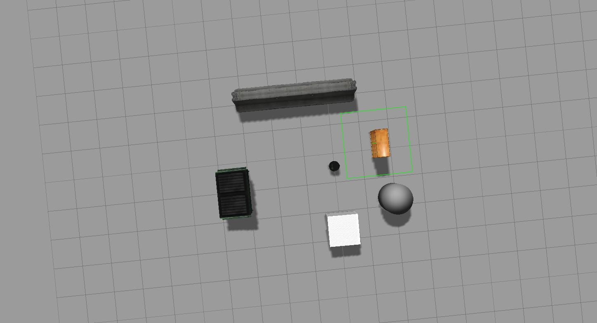

# ROS SimpleWalker Project
[](https://travis-ci.org/htsai51/simplewalker)
[](https://coveralls.io/github/htsai51/simplewalker?branch=master)
----

## Overview

This is a ROS project which implements a simple walker algorithm like a Roomba robot vacuum cleaner.
The robot moves forward until it is within 0.5m close to an obstacle and then rotate in place until 
it senses the way ahead is clear.

## Dependencies

- Ubuntu 14.04
- ROS indigo
- Gazebo
- TurtleBot_Gazebo
- Package Dependencies
    - roscpp
    - geometry_msgs
    - move_base_msgs
    - sensor_msgs

## Build

```bash
$ mkdir -p ~/catkin_ws/src
$ cd ~/catkin_ws/src
$ catkin_init_workspace
$ git clone --recursive https://github.com/htsai51/simplewalker
$ cd ~/catkin_ws/
$ catkin_make
```

## Run - roslaunch

Use roslaunch to run simplewalker with Turtlebot Gazebo simulation

Open a new terminal to make sure roscore is running:
```bash
$ roscore
```
Open a new terminal to run launch file:
```bash
$ cd ~/catkin_ws
$ source ./devel/setup.bash
$ roslaunch simplewalker simplewalker.launch
```

You will see Gazebo simulation as below.  In the simulation, turtlebot will move
forward until it is close to obstacle, rotate until it sees no obstacle in front,
moves forward again and repeat.



## Play/Record - rosbag

SimpleWalker launch file supports recording topics in walker simulation (except /camera/*).  This can be
done by specifying "enable_record" argument. By default, recording is disabled.

To enable rosbag recording:

```bash
cd ~/catkin_ws
source ./devel/setup.bash
roslaunch simplewalker simplewalker.launch enable_record:=true
```

To inspect rosbag recording result:

```bash
cd ~/.ros/
rosbag info session.bag
```

The output should look like
```bash
path:        session.bag
version:     2.0
duration:    43.0s
start:       Dec 31 1969 19:00:00.01 (0.01)
end:         Dec 31 1969 19:00:43.00 (43.00)
size:        16.1 MB
messages:    30832
compression: none [21/21 chunks]
types:       bond/Status                           [eacc84bf5d65b6777d4c50f463dfb9c8]
             dynamic_reconfigure/Config            [958f16a05573709014982821e6822580]
             dynamic_reconfigure/ConfigDescription [757ce9d44ba8ddd801bb30bc456f946f]
             gazebo_msgs/LinkStates                [48c080191eb15c41858319b4d8a609c2]
             gazebo_msgs/ModelStates               [48c080191eb15c41858319b4d8a609c2]
             geometry_msgs/Twist                   [9f195f881246fdfa2798d1d3eebca84a]
             nav_msgs/Odometry                     [cd5e73d190d741a2f92e81eda573aca7]
             rosgraph_msgs/Clock                   [a9c97c1d230cfc112e270351a944ee47]
             rosgraph_msgs/Log                     [acffd30cd6b6de30f120938c17c593fb]
             sensor_msgs/Imu                       [6a62c6daae103f4ff57a132d6f95cec2]
             sensor_msgs/JointState                [3066dcd76a6cfaef579bd0f34173e9fd]
             sensor_msgs/LaserScan                 [90c7ef2dc6895d81024acba2ac42f369]
             std_msgs/String                       [992ce8a1687cec8c8bd883ec73ca41d1]
             tf2_msgs/TFMessage                    [94810edda583a504dfda3829e70d7eec]
topics:      /clock                                            4299 msgs    : rosgraph_msgs/Clock                  
             /cmd_vel_mux/active                                  1 msg     : std_msgs/String                      
             /cmd_vel_mux/parameter_descriptions                  1 msg     : dynamic_reconfigure/ConfigDescription
             /cmd_vel_mux/parameter_updates                       1 msg     : dynamic_reconfigure/Config           
             /depthimage_to_laserscan/parameter_descriptions      1 msg     : dynamic_reconfigure/ConfigDescription
             /depthimage_to_laserscan/parameter_updates           1 msg     : dynamic_reconfigure/Config           
             /gazebo/link_states                               4297 msgs    : gazebo_msgs/LinkStates               
             /gazebo/model_states                              4297 msgs    : gazebo_msgs/ModelStates              
             /gazebo/parameter_descriptions                       1 msg     : dynamic_reconfigure/ConfigDescription
             /gazebo/parameter_updates                            1 msg     : dynamic_reconfigure/Config           
             /joint_states                                     4176 msgs    : sensor_msgs/JointState               
             /laserscan_nodelet_manager/bond                     82 msgs    : bond/Status                           (2 connections)
             /mobile_base/commands/velocity                     412 msgs    : geometry_msgs/Twist                  
             /mobile_base/sensors/imu_data                     4176 msgs    : sensor_msgs/Imu                      
             /mobile_base_nodelet_manager/bond                  175 msgs    : bond/Status                           (3 connections)
             /odom                                             4186 msgs    : nav_msgs/Odometry                    
             /rosout                                             53 msgs    : rosgraph_msgs/Log                     (9 connections)
             /rosout_agg                                         39 msgs    : rosgraph_msgs/Log                    
             /scan                                              348 msgs    : sensor_msgs/LaserScan                
             /tf                                               4285 msgs    : tf2_msgs/TFMessage

```

To playback rosbag recording:

In a new terminal
```bash
cd ~/.ros/
rosbag play session.bag
```
